<div align="center">



<h1>alpaca</h1>

<p>
Self-host a model with Ollama and reach it from every machine you own.<br>
One binary serves an OpenAI-compatible API — the client finds it on its own.
</p>

</div>

## Setup

You need [Ollama](https://ollama.com) running with at least one model pulled:

```sh
ollama pull llama3.2
```

On the machine with the model:

```sh
alpaca serve
```

It prints a connect string. On every other machine, paste it once:

```sh
alpaca link alpaca1:eyJpIjoi...
alpaca chat
```

That is the whole setup. The connect string carries the API key, the pinned
certificate, and every route to the server, so there is nothing else to
configure and nothing to re-enter later.

## How it finds the server

You paste one string; after that the address is alpaca's problem, not yours. On
every launch the client races each route it knows and keeps whichever answers
first.

| Route | Transport | When it wins |
| --- | --- | --- |
| Last known good | as before | Nothing moved since last time — the usual case |
| mDNS discovery | plain HTTP | Same network, but the server's IP changed |
| LAN hints | plain HTTP | Same network, multicast blocked |
| Public endpoint | TLS, pinned | You are somewhere else entirely |

The public candidate starts 300 ms late on purpose. Without that stagger it
sometimes wins a race it should lose — reaching a machine in the same room by
going out to the internet and back. The delay costs nothing when LAN works,
because the public probe is never opened.

Every probe checks the server's identity, not just that something answered. A
LAN hint captured months ago may now point at whatever machine DHCP handed the
address to since.

Because addresses change but identity does not, a connect string keeps working
across reboots, DHCP leases, and moving between networks. You only need a new
one if you rotate the key or the certificate.

## Reaching it from outside your network

In order of preference:

1. **Tailscale.** If the server is on your tailnet it already works from
   anywhere, with WireGuard doing the encryption. Nothing to configure — alpaca
   picks up the tailnet address by itself.
2. **IPv6.** Most home connections have a globally routable IPv6 address, which
   needs no port forwarding at all. alpaca offers it automatically over TLS,
   though your router firewall may still want an inbound rule.
3. **UPnP / NAT-PMP.** If enabled on the router, alpaca requests a port forward
   at startup and renews it while running. Many routers ship with this off, and
   it cannot work behind carrier-grade NAT; alpaca detects that case and says so
   rather than advertising an address that silently fails.
4. **A manual port forward.** Forward a port yourself and start with
   `alpaca serve --public your.address:8080`.

Anything outside your LAN or tailnet is always TLS.

## Security

- **One API key**, generated on first run and required on every endpoint except
  the health check. Compared in constant time.
- **TLS with certificate pinning.** The self-signed certificate is pinned by
  SHA-256 fingerprint inside the connect string, so there is no certificate
  authority to trust and nothing to renew. That is stronger than ordinary CA
  validation here: a mis-issued public certificate for your address is still
  rejected.
- **Plain HTTP only on networks that are already private** — RFC 1918, IPv6
  unique-local, and Tailscale. Anything internet-routable is TLS-only, including
  a public IPv6 address on the server itself.
- The connect string **contains the API key**. Treat it like a password.
- Revoke everything with `alpaca serve --rotate-key` (or `--rotate-cert`). Every
  previously linked machine then has to re-link.

`alpaca serve` binds all interfaces by default so other machines can reach it.
Use `--bind 127.0.0.1` if you only want local access.

## Using it from other tools

The gateway speaks the OpenAI API, so most existing tooling works by pointing a
base URL at it:

```sh
curl http://192.168.1.20:8080/v1/chat/completions \
  -H "Authorization: Bearer alp_..." \
  -H "Content-Type: application/json" \
  -d '{"model":"llama3.2:latest","messages":[{"role":"user","content":"hello"}]}'
```

```python
from openai import OpenAI

client = OpenAI(base_url="http://192.168.1.20:8080/v1", api_key="alp_...")
client.chat.completions.create(
    model="llama3.2:latest",
    messages=[{"role": "user", "content": "hello"}],
)
```

Implemented: `/v1/chat/completions` (streaming and buffered), `/v1/models`,
`/v1/embeddings`, plus `/healthz` and `/api/info`.

Supported request fields include `temperature`, `top_p`, `seed`, `stop` (string
or array), `max_tokens` and `max_completion_tokens`, `response_format:
json_object`, `stream_options.include_usage`, and multimodal `content` arrays
carrying base64 `data:` image URLs. Remote image URLs are refused rather than
fetched — fetching them would turn the gateway into an SSRF proxy into your
network.

## The chat interface

| Key | Action |
| --- | --- |
| `enter` | Send |
| `ctrl+j` | Newline (terminals do not transmit `shift+enter`) |
| `esc` | Stop generating, or clear the composer |
| `ctrl+p` | Switch model |
| `ctrl+n` | New chat |
| `ctrl+s` | Browse saved chats |
| `ctrl+r` | Regenerate the last reply |
| `ctrl+y` | Copy the last reply |
| `pgup` / `pgdn`, `ctrl+u` / `ctrl+d` | Scroll |
| `?` | All keys |
| `ctrl+c` | Quit |

Slash commands do the same things: `/model`, `/new`, `/sessions`, `/system`,
`/retry`, `/copy`, `/clear`, `/stats`, `/help`, `/quit`.

Chats are saved automatically as JSON under `~/.config/alpaca/sessions/`.
`alpaca chat` starts a new conversation each time, so old context never attaches
itself silently to an unrelated question — use `--resume` or `ctrl+s` to pick up
where you left off.

## Commands

```
alpaca serve                  start the API and print a connect string
alpaca link <connect-string>  save a server (also reads stdin)
alpaca chat                   open the chat interface
alpaca ask "question"         one-shot answer on stdout
alpaca models                 list models on the server
alpaca status                 show which servers are linked and reachable
alpaca profiles               list / remove / set default
alpaca discover               find alpaca servers on this network
```

`ask` is built for pipes:

```sh
alpaca ask "explain this error" < build.log
cat main.go | alpaca ask "review this" > review.md
```

Every command takes `--help`, and multiple servers are supported via `--profile`.

## Building

```sh
make build   # ./alpaca for this machine
make test    # everything, with the race detector
make cross   # dist/ binaries for linux, macos, and windows
```

Or directly:

```sh
go build -o alpaca ./cmd/alpaca
GOOS=linux GOARCH=amd64 go build -o alpaca-linux ./cmd/alpaca
```

There is no cgo and there are no runtime dependencies, so deploying to another
machine means copying one file.

## Where things live

Everything sits in `~/.config/alpaca` (override with `ALPACA_HOME`):

```
server.json      this machine's identity and API key   (serve)
certs/           self-signed certificate and key       (serve)
profiles.json    linked servers                        (clients)
sessions/        saved chats                           (clients)
```

Files are `0600` and written atomically, so an interrupted save cannot corrupt a
key or lose history.

## Troubleshooting

**"could not reach … on any known route."** Check that `alpaca serve` is still
running. If the server moved networks, `alpaca discover` will find it, or re-link
with a fresh connect string.

**The first connection on macOS fails, then works.** macOS asks for Local Network
permission the first time a binary talks to a LAN address, and blocks that
attempt while asking. Approve it and retry; this happens once per binary.

**"internet: unavailable."** The router has UPnP/NAT-PMP disabled, or you are
behind carrier-grade NAT. LAN and tailnet are unaffected — see
[Reaching it from outside your network](#reaching-it-from-outside-your-network).

**mDNS finds nothing.** Some networks block multicast and most VPNs do. The LAN
hints and public endpoint from the connect string still work; add
`--no-discovery` to skip the scan and save a couple of seconds.

**A model is missing.** Models come from Ollama on the server, so pull it there:
`ollama pull qwen2.5`.

## License

MIT — see [LICENSE](LICENSE).
