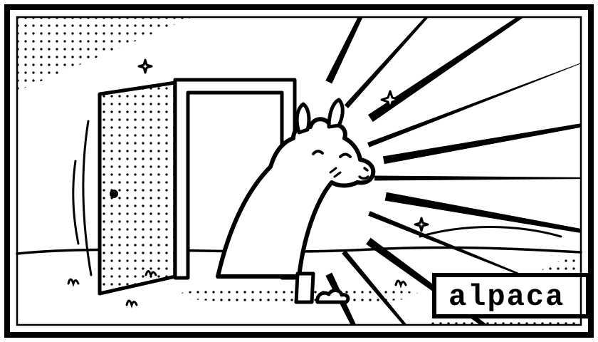

<div align="center">



# alpaca

**Self-host a model with Ollama and reach it from every machine you own.**<br>
*One binary serves an OpenAI-compatible API — the client finds it on its own.*

</div>

---

## Setup

You need [Ollama](https://ollama.com) running with at least one model pulled:

```sh
ollama pull llama3.2
```

Then build alpaca and put it on your PATH (see
[Building and installing](#building-and-installing) for the details):

```sh
make install
```

On the machine with the model:

```sh
alpaca serve
```

It prints a connect string. On every other machine, paste it once:

```sh
alpaca link alpaca1:eyJpIjoi...
alpaca chat
```

That is the whole setup. The connect string carries the API key, the pinned
certificate, and every route to the server, so there is nothing else to
configure and nothing to re-enter later.

### Trying it without a server

To see what the interface looks like before setting any of that up:

```sh
alpaca chat --demo
```

That runs the real chat interface against a canned server inside the binary —
no gateway, no Ollama, no network. Streaming, markdown, the model picker, saved
chats, and the web-search status line all behave as they normally do; only the
replies are fake. Ask for **code** or **markdown**, or mention **search**, to see
different parts of the renderer.

Demo sessions are written to a temporary directory and deleted on exit, so
poking at it never mixes fake conversations into your real history.

## How it finds the server

You paste one string; after that the address is alpaca's problem, not yours. On
every launch the client races each route it knows and keeps whichever answers
first.


| Route | Transport | When it wins |
| --- | --- | --- |
| Last known good | as before | Nothing moved since last time — the usual case |
| mDNS discovery | TLS, pinned | Same network, but the server's IP changed |
| LAN hints | plain HTTP | Same network, multicast blocked |
| Public endpoint | TLS, pinned | You are somewhere else entirely |

Discovered routes use pinned TLS even on the LAN: a hint you pasted is
something you vouched for, but an mDNS answer is just a claim from the network,
so whoever answers has to present the pinned certificate before the client will
talk to it.

The public candidate starts 300 ms late on purpose. Without that stagger it
sometimes wins a race it should lose — reaching a machine in the same room by
going out to the internet and back. The delay costs nothing when LAN works,
because the public probe is never opened.

Every probe checks the server's identity, not just that something answered. A
LAN hint captured months ago may now point at whatever machine DHCP handed the
address to since.

Because addresses change but identity does not, a connect string keeps working
across reboots, DHCP leases, and moving between networks. You only need a new
one if you rotate the key or the certificate.

## Reaching it from outside your network

In order of preference:

1. **Tailscale.** If the server is on your tailnet it already works from
   anywhere, with WireGuard doing the encryption. Nothing to configure — alpaca
   picks up the tailnet address by itself.
2. **IPv6.** Most home connections have a globally routable IPv6 address, which
   needs no port forwarding at all. alpaca offers it automatically over TLS,
   though your router firewall may still want an inbound rule.
3. **UPnP / NAT-PMP.** If enabled on the router, alpaca requests a port forward
   at startup and renews it while running. Many routers ship with this off, and
   it cannot work behind carrier-grade NAT; alpaca detects that case and says so
   rather than advertising an address that silently fails.
4. **A manual port forward.** Forward a port yourself and start with
   `alpaca serve --public your.address:8080`.

Anything outside your LAN or tailnet is always TLS.

## Security

- **One API key**, generated on first run and required on every endpoint except
  the health check. Compared in constant time.
- **TLS with certificate pinning.** The self-signed certificate is pinned by
  SHA-256 fingerprint inside the connect string, so there is no certificate
  authority to trust and nothing to renew. That is stronger than ordinary CA
  validation here: a mis-issued public certificate for your address is still
  rejected.
- **Plain HTTP only on networks that are already private** — RFC 1918, IPv6
  unique-local, and Tailscale. Anything internet-routable is TLS-only, including
  a public IPv6 address on the server itself. The client enforces the same
  boundary on its side, and mDNS-discovered routes are always pinned TLS.
- The connect string **contains the API key**. Treat it like a password.
- Revoke everything with `alpaca serve --rotate-key` (or `--rotate-cert`). Every
  previously linked machine then has to re-link.

`alpaca serve` binds all interfaces by default so other machines can reach it.
Use `--bind 127.0.0.1` if you only want local access.

## Default model

`alpaca serve --model gpt-oss:20b` names the model new chats should start on.
It is listed first in `/v1/models`, which is what alpaca's TUI (and most
OpenAI clients) adopt for a fresh session — without it, the order is whatever
ollama reports, and a freshly pulled embedding model would end up the default.
The choice persists in `server.json`, so the flag only needs passing once; a
prefix works (`--model gpt-oss`), and `--model ""` clears it.

## Web search

The model can look things up. The gateway runs the searches itself, so every
client gets the capability with nothing to configure — the TUI, `alpaca ask`,
curl, an OpenAI SDK.

Search is off unless you turn it on, and the only provider is
[SearXNG](https://docs.searxng.org), which you host yourself:

```sh
docker run -d --name searxng -p 8888:8080 searxng/searxng
alpaca serve --search searxng --search-url http://localhost:8888
```

**SearXNG ships with JSON output disabled**, and returns `403` until you enable
it. In its `settings.yml`:

```yaml
search:
  formats:
    - html
    - json
```

For a local-only instance you may also need `server.limiter: false`. alpaca
detects that specific `403` and prints these instructions rather than making you
go looking.

Only the snippets SearXNG already returns are used — alpaca never fetches the
result pages. A search is one request from your machine rather than one per hit,
and repeated queries are cached for ten minutes.

`--search-results N` caps hits per query (default 5) and `--search-rounds N`
caps searches per reply (default 3). After that the tool is withheld so the
model has to answer.

### On small models deciding when to search

Automatic search is a convenience, not a guarantee. Measured on `llama3.2:3b`,
the decision to reach for the tool is close to a coin flip on anything
borderline: the same prompt run twice can go either way, and two quite different
tool descriptions scored identically over the same set. Sampling noise dominates.

So when you actually need a lookup to happen, ask for it directly:

```
/search go 1.26 release notes
```

That always runs and folds the results into the conversation. There's a
`POST /api/search` endpoint behind it if you want it from a script. Larger
tool-tuned models make much better use of automatic search.

## Using it from other tools

The gateway speaks the OpenAI API, so most existing tooling works by pointing a
base URL at it:

```sh
curl http://192.168.1.20:8080/v1/chat/completions \
  -H "Authorization: Bearer alp_..." \
  -H "Content-Type: application/json" \
  -d '{"model":"llama3.2:latest","messages":[{"role":"user","content":"hello"}]}'
```

```python
from openai import OpenAI

client = OpenAI(base_url="http://192.168.1.20:8080/v1", api_key="alp_...")
client.chat.completions.create(
    model="llama3.2:latest",
    messages=[{"role": "user", "content": "hello"}],
)
```

Implemented: `/v1/chat/completions` (streaming and buffered), `/v1/models`,
`/v1/embeddings`, plus `/healthz`, `/api/info`, and `/api/search`.

Supported request fields include `temperature`, `top_p`, `seed`, `stop` (string
or array), `max_tokens` and `max_completion_tokens`, `response_format:
json_object`, `stream_options.include_usage`, and multimodal `content` arrays
carrying base64 `data:` image URLs. Remote image URLs are refused rather than
fetched — fetching them would turn the gateway into an SSRF proxy into your
network.

## The chat interface

| Key | Action |
| --- | --- |
| `enter` | Send |
| `ctrl+j` | Newline (see [shift+enter](#shiftenter) below) |
| `esc` | Stop generating, or clear the composer |
| `ctrl+p` | Switch model — a popup over the chat |
| `ctrl+n` | New chat |
| `ctrl+s` | Browse saved chats — a drawer beside the chat |
| `ctrl+r` | Regenerate the last reply |
| `ctrl+y` | Copy the last reply |
| `ctrl+g` | Copy the last code block — or click `⧉ copy` on any block |
| mouse wheel, `pgup` / `pgdn`, `ctrl+u` / `ctrl+d` | Scroll |
| `?` | All keys |
| `ctrl+c` | Quit |

Slash commands do the same things, plus `/search <query>` when the server has
search enabled: `/model`, `/new`, `/sessions`, `/system`, `/retry`, `/copy`,
`/clear`, `/search`, `/graph`, `/stats`, `/help`, `/quit`.

The composer grows with what you type, up to about a third of the screen, and
scrolls inside its frame past that — the cursor stays in view either way.

Pasting more than a few lines stages the paste as a chip above the input —
`[#1 · 42 lines pasted]` — instead of flooding the composer; the full text
still travels with the message when you send. Dropping an image file onto the
terminal stages it the same way. Press `↑` from the top of the input to focus
the chips, `←`/`→` to move between them, `enter` to open one in a popup —
pasted text scrollable in full, images downsampled to coloured terminal cells
— and `backspace` to remove one. Image previews are local only: the chat
connection is text-only, so the model is told an image was attached but never
receives it.

Replies render their fenced code in framed blocks: a header rule names the
language and carries a `⧉ copy` control you can click with the mouse — it
flashes `✓ copied!` when the copy lands — and `ctrl+g` copies the newest
block without reaching for it.

Long sent messages fold in their bubble (`… +26 more lines`); click any of
your bubbles to read the whole message in a scrollable popup, `y` to copy it,
`esc` to close.

### Editing and branching

Click one of your bubbles and press `e`: the prompt comes back into the
composer — the frame turns yellow while the edit is armed — and sending it
branches the conversation at that point. The old continuation is kept, not
overwritten. A branched prompt wears a yellow `✦ ‹ 2/2 ›` marker under its
bubble; click it again and `←`/`→` swap the whole tail of the conversation
between variants, with nested branches resuming exactly where you left them.
`esc` abandons an armed edit without touching anything.

Branches persist in the session file with the rest of the chat. Regenerating
a reply (`ctrl+r`) still replaces it in place — only editing a prompt forks.

### The conversation graph

`/graph` draws the whole conversation as a tree: every prompt (`●`) and reply
(`○`) compressed to one line, forks fanned out sideways with a `✦`, the live
branch bright and the abandoned ones dimmed. `↑`/`↓` or the wheel move,
`enter` or a click jumps to that message in the chat — switching branches on
the way when it lives on an inactive one — and `esc` closes.

The one-line labels come from a **graphing model**: `/graph model` picks one
(`m` inside the graph does the same, `r` re-summarizes everything with it);
until you choose, the chat model does double duty. Each message is summarized
once, in the background while the graph is open, and the sentence is saved
into the session file — a message never changes after it is sent, so its
summary never goes stale.

Drag with the mouse to select text — in the chat, the composer, even inside a
popup. The highlight follows the drag, and releasing the button copies the
selection to the clipboard, exactly as it appears on screen. A keypress,
scroll, or click dismisses the highlight. (Your terminal's own selection
still works too, usually while holding a modifier such as `shift` or `fn` /
`alt`.)

### shift+enter

Terminals transmit `shift+enter` as a plain `enter` — the application never
sees the shift — so no TUI can support it natively. What every terminal *can*
do is send a newline for that key combination itself, which makes
`shift+enter` insert a newline exactly like `ctrl+j`:

**Alacritty** (`~/.config/alacritty/alacritty.toml`):

```toml
[keyboard]
bindings = [{ key = "Return", mods = "Shift", chars = "\n" }]
```

**kitty** (`~/.config/kitty/kitty.conf`):

```
map shift+enter send_text all \n
```

**WezTerm** (`~/.wezterm.lua`):

```lua
keys = { { key = "Enter", mods = "SHIFT", action = wezterm.action.SendString("\n") } }
```

**iTerm2**: Settings → Profiles → Keys → Key Mappings → `+`, record
`shift+enter`, choose *Send Text* and enter `\n`.

Chats are saved automatically as JSON under `~/.config/alpaca/sessions/`.
`alpaca chat` starts a new conversation each time, so old context never attaches
itself silently to an unrelated question — use `--resume` or `ctrl+s` to pick up
where you left off.

## The desktop app

The same binary is also a desktop application. On macOS, `make` assembles
**Alpaca.app** and puts it in `/Applications`; launch it from the Dock,
Spotlight, or Finder and the chat opens as a window. Booted bare from a
terminal, `alpaca` opens the TUI instead — one binary, and the way you start
it picks the surface.

`alpaca gui` is the explicit form (and works on any platform):

```
alpaca gui                open the window against your default server
alpaca gui --demo         the window with canned replies, no server
alpaca gui --no-open      print the address instead of opening the browser
alpaca gui --port 8080    listen on a fixed port
```

The window is the binary serving a self-contained page on `127.0.0.1` — no
Electron, no runtime, nothing to download, works offline. It shares the
TUI's session store, so a chat started in the terminal continues in the
window and vice versa, and it streams, renders markdown and code blocks with
copy buttons, switches models, and browses saved chats.

Two details worth knowing:

- **It only answers its own window.** The server binds loopback and every
  API call needs a token minted at launch and known only to the page it
  served, so nothing else on the machine (or the network) can drive it.
- **It puts itself away.** Launched from the Dock there is no terminal to
  `ctrl+c`, so once the window closes and its heartbeat goes quiet for a
  couple of minutes, the process exits on its own. Launched from a terminal
  it stays up until you stop it.

## Commands

```
alpaca serve                  start the API and print a connect string
alpaca link <connect-string>  save a server (also reads stdin)
alpaca chat                   open the chat interface in the terminal
alpaca chat --demo            open it with no server, using canned replies
alpaca gui                    open the chat as a desktop window instead
alpaca ask "question"         one-shot answer on stdout
alpaca models                 list models on the server
alpaca status                 show which servers are linked and reachable
alpaca profiles               list / remove / set default
alpaca discover               find alpaca servers on this network
```

`ask` is built for pipes:

```sh
alpaca ask "explain this error" < build.log
cat main.go | alpaca ask "review this" > review.md
```

Every command takes `--help`, and multiple servers are supported via `--profile`.

## Building and installing

```sh
make            # build, install onto your PATH — and Alpaca.app on macOS
make build      # ./alpaca in the repo, nothing installed
make install    # install the binary just built
make update     # stop a running alpaca, replace everything installed fresh
```

`make install` builds first and installs that binary, so what lands on your PATH
is exactly what was just built. It picks the first directory that is both
writable and already on your PATH — `$GOBIN`, then `$GOPATH/bin`, then
`~/.local/bin`, then `/usr/local/bin` — and only reaches for `sudo` if the
target needs it.

```sh
make where      # show the version, the chosen directory, and what's installed
make uninstall  # remove it again
```

Override the destination with `make install BINDIR=/somewhere/else`. If the
chosen directory turns out not to be on your PATH, or an older copy of `alpaca`
elsewhere shadows the new one, `make install` says so rather than appearing to
succeed.

```sh
make test       # everything, with the race detector
make cross      # dist/ binaries for linux, macos, and windows
```


Or without make:

```sh
go build -o alpaca ./cmd/alpaca
GOOS=linux GOARCH=amd64 go build -o alpaca-linux ./cmd/alpaca
```

There is no cgo and there are no runtime dependencies, so deploying to another
machine means copying one file.

## Where things live

Everything sits in `~/.config/alpaca` (override with `ALPACA_HOME`):

```
server.json      this machine's identity and API key   (serve)
certs/           self-signed certificate and key       (serve)
profiles.json    linked servers                        (clients)
sessions/        saved chats                           (clients)
```

Files are `0600` and written atomically, so an interrupted save cannot corrupt a
key or lose history. A `profiles.json.lock` sidecar serialises writers, so two
alpaca processes updating profiles at once cannot lose each other's changes.

## Troubleshooting

**"could not reach … on any known route."** Check that `alpaca serve` is still
running. If the server moved networks, `alpaca discover` will find it, or re-link
with a fresh connect string.

**Every route fails but ssh to the server works.** Something between you and
the server filters by port: a tailnet ACL that only opens specific ports, or a
router that restricts client-to-client traffic. Either open tcp:8080 to the
server (one line in the Tailscale admin console's ACL), or ride the port that
already works — a `ssh -N -L 18080:127.0.0.1:8080 server` tunnel, with
`127.0.0.1:18080` added to the profile's `lan` hints in `profiles.json`,
behaves exactly like a local route.

**The first connection on macOS fails, then works.** macOS asks for Local Network
permission the first time a binary talks to a LAN address, and blocks that
attempt while asking. Approve it and retry; this happens once per binary.

**"internet: unavailable."** The router has UPnP/NAT-PMP disabled, or you are
behind carrier-grade NAT. LAN and tailnet are unaffected — see
[Reaching it from outside your network](#reaching-it-from-outside-your-network).

**mDNS finds nothing.** Some networks block multicast and most VPNs do. The LAN
hints and public endpoint from the connect string still work; add
`--no-discovery` to skip the scan and save a couple of seconds.

**A model is missing.** Models come from Ollama on the server, so pull it there:
`ollama pull qwen2.5`.

## License

MIT — see [LICENSE](LICENSE).
